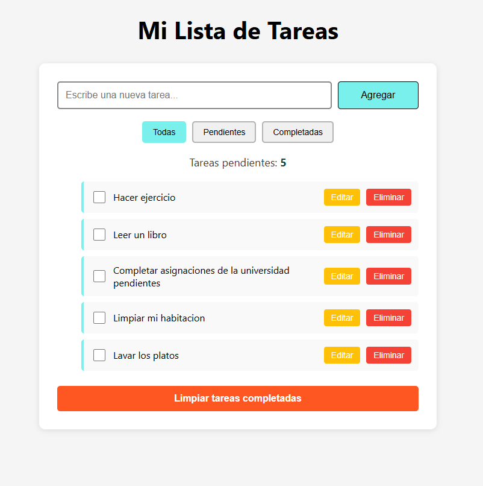

# To-Do List con LocalStorage

Aplicación de lista de tareas (To-Do List) desarrollada con HTML, CSS y JavaScript vanilla. Los datos persisten en el navegador usando LocalStorage.

## Funcionalidades

- Agregar nuevas tareas
- Editar el texto de una tarea existente
- Eliminar tareas individuales
- Marcar/desmarcar tareas como completadas
- Filtrar tareas por Todas / Pendientes / Completadas
- Limpiar todas las tareas completadas de una vez

## Tecnologías

- HTML5
- CSS3
- JavaScript (vanilla)
- LocalStorage API

## Cómo usarlo

1. Clona el repositorio
2. Abre `index.html` en tu navegador
3. Empieza a agregar tareas — se guardan automáticamente en tu navegador

## Metodología de desarrollo

Este proyecto fue desarrollado siguiendo Git Flow: cada funcionalidad se implementó en su propia rama `feature/`, con un `hotfix/` adicional para corregir un caso borde en la función de limpiar tareas completadas. Todas las ramas se integraron a través de Pull Requests hacia `dev`, `qa` y `main`.